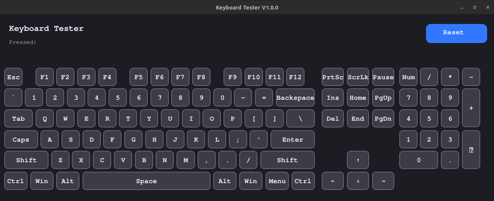
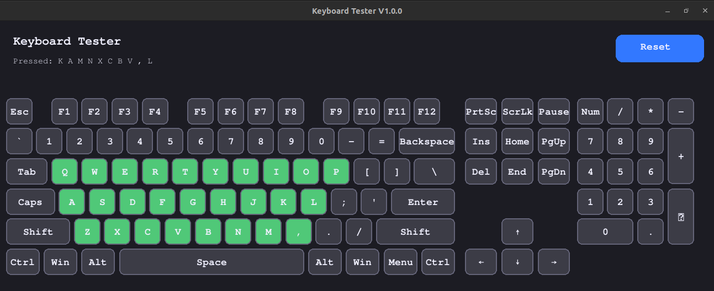

<div align="center">

# ⌨️ Keyboard Tester V1.0.0

**Aplikasi Desktop Profesional untuk Testing Keyboard**

[](https://www.python.org/)
[](https://www.pygame.org/)
[](https://github.com)
[](LICENSE)

<p align="center">
  
</p>

### 🎯 Aplikasi modern dengan antarmuka visual yang menarik untuk menguji seluruh tombol keyboard Anda secara real-time

[📥 Download](#-download-versi-siap-pakai) • [🚀 Quick Start](#-quick-start) • [✨ Fitur](#-fitur-unggulan) • [📖 Dokumentasi](#-dokumentasi-lengkap)

</div>

---

## 📸 Preview Aplikasi

<p align="center">
  
</p>

---

## ✨ Fitur Unggulan

<table>
<tr>
<td width="50%">

### 🎨 **Visual Feedback Real-time**
- **3 Status Warna Berbeda:**
  - 🔘 **Abu-abu (Default)** - Tombol belum pernah ditekan
  - 🟢 **Hijau (Ever Pressed)** - Tombol pernah ditekan
  - 🔴 **Merah (Active)** - Tombol sedang ditekan
- Animasi smooth dengan 60 FPS
- Border rounded untuk estetika modern

### ⌨️ **Full-Size Keyboard Layout**
- **104 tombol lengkap** termasuk:
  - ✅ Function keys (F1-F12)
  - ✅ Alphanumeric keys
  - ✅ Navigation cluster (Ins, Del, Home, End, dll)
  - ✅ Arrow keys
  - ✅ Full Numpad
  - ✅ Modifier keys (Ctrl, Alt, Shift, Win)

</td>
<td width="50%">

### 🖥️ **User Interface Modern**
- Dark theme yang nyaman untuk mata
- **Window Resizable** - ukuran menyesuaikan otomatis
- Font Consolas yang jelas dan profesional
- Layout responsif untuk berbagai resolusi layar

### 📊 **Tracking & History**
- Menampilkan **10 tombol terakhir** yang ditekan
- Riwayat penekanan tombol secara berurutan
- Status real-time untuk setiap tombol

### 🔄 **Fungsi Reset**
- Tombol reset dengan warna biru mencolok
- Clear semua status dengan satu klik
- Memulai testing dari awal dengan mudah

</td>
</tr>
</table>

---

## 🎯 Manfaat Penggunaan

| Kegunaan | Deskripsi |
|----------|-----------|
| 🔧 **Testing Keyboard Baru** | Verifikasi semua tombol berfungsi sebelum membeli keyboard |
| 🛠️ **Troubleshooting** | Identifikasi tombol yang rusak atau tidak responsif |
| 🎮 **Gaming Keyboard Check** | Test anti-ghosting dan N-key rollover |
| ⌨️ **Mechanical Keyboard** | Uji switch yang baru di-lube atau di-mod |
| 💼 **Quality Control** | Untuk toko/service center yang menjual keyboard |
| 📝 **Dokumentasi** | Screenshot hasil testing untuk laporan atau klaim garansi |

---

## 🚀 Quick Start

### 📥 Download Versi Siap Pakai

**Tidak perlu install Python atau dependencies!** Langsung jalankan executable.

#### 🐧 Linux
```bash
# Download dan jalankan
cd realise/linux/
chmod +x KeyboardTester-V1.0.0
./KeyboardTester-V1.0.0
```

#### 🪟 Windows
```cmd
# Buka folder dan jalankan
realise\wndows\Keyboard Tester V1.0.2.exe
```

> **💡 Tip:** Double-click file executable untuk langsung menjalankan aplikasi!

---

## 💻 Menjalankan dari Source Code

### Prasyarat
- **Python 3.8+** terinstall di sistem
- **Pygame** library

### Langkah Instalasi

#### 1️⃣ Install Pygame

**Linux:**
```bash
pip3 install pygame
```

**Windows:**
```cmd
pip install pygame
```

#### 2️⃣ Jalankan Aplikasi

**Linux:**
```bash
python3 keyboard.py
```

**Windows:**
```cmd
python keyboard.py
```

---

## 🔨 Build Executable Sendiri

Ingin membuat executable custom? Ikuti langkah berikut:

### **Linux Build**

```bash
# 1. Install dependencies
pip3 install pygame pyinstaller

# 2. Build executable
pyinstaller --onefile --windowed --name="KeyboardTester" keyboard.py

# 3. Hasil ada di folder dist/
./dist/KeyboardTester
```

### **Windows Build**

```cmd
REM 1. Install dependencies
pip install pygame pyinstaller

REM 2. Build executable
pyinstaller --onefile --windowed --name="KeyboardTester" keyboard.py

REM 3. Hasil ada di folder dist\
dist\KeyboardTester.exe
```

### 🎨 Build dengan Custom Icon

```bash
# Dengan icon custom (opsional)
pyinstaller --onefile --windowed --icon=keyboard.ico keyboard.py
```

---

## 📖 Dokumentasi Lengkap

### 🎮 Cara Menggunakan

<table>
<tr>
<td width="30%"><strong>1. Jalankan Aplikasi</strong></td>
<td width="70%">Buka executable atau jalankan <code>keyboard.py</code></td>
</tr>
<tr>
<td><strong>2. Mulai Testing</strong></td>
<td>Tekan tombol apa saja di keyboard Anda secara bergantian</td>
</tr>
<tr>
<td><strong>3. Perhatikan Warna</strong></td>
<td>
  • Abu-abu → Belum ditekan<br>
  • Hijau → Pernah ditekan<br>
  • Merah → Sedang ditekan
</td>
</tr>
<tr>
<td><strong>4. Lihat History</strong></td>
<td>Panel "Pressed" menampilkan 10 tombol terakhir</td>
</tr>
<tr>
<td><strong>5. Reset Testing</strong></td>
<td>Klik tombol "Reset" biru di pojok kanan atas</td>
</tr>
</table>

### 🎨 Skema Warna

```python
Background      : RGB(28, 28, 35)    # Dark navy
Tombol Default  : RGB(60, 60, 70)    # Abu-abu gelap
Tombol Pressed  : RGB(80, 200, 120)  # Hijau terang
Tombol Active   : RGB(220, 60, 60)   # Merah cerah
Border          : RGB(100, 100, 120) # Abu-abu biru
Teks            : RGB(240, 240, 255) # Putih lembut
Reset Button    : RGB(50, 120, 255)  # Biru cerah
```

### ⚙️ Fitur Teknis

- **Engine:** Pygame 2.5+
- **FPS:** 60 frames per second
- **Window:** Resizable (min: 800x600, max: auto-detect)
- **Initial Size:** 1440x920 atau sesuai layar
- **Font:** Consolas (built-in system font)
- **Keyboard Mapping:** 104+ keys terdeteksi

### 📁 Struktur Proyek

```
KeyboardTester/
├── 📄 keyboard.py              # Source code utama (Pygame)
├── 📄 keyboard_tester.py       # Source code alternatif (Tkinter)
├── 📄 requirements.txt         # Python dependencies
├── 📄 README.md                # Dokumentasi ini
├── 📄 KeyboardTester.spec      # PyInstaller spec file
├── 📁 image/                   # Screenshot aplikasi
│   ├── ss1.png
│   └── ss2.png
├── 📁 realise/                 # Executable siap pakai
│   ├── 📁 linux/
│   │   └── KeyboardTester-V1.0.0
│   └── 📁 wndows/
│       └── Keyboard Tester V1.0.2.exe
└── 📁 build/                   # Build artifacts
```

---

## 🐛 Troubleshooting

<details>
<summary><strong>❌ ImportError: No module named 'pygame'</strong></summary>

**Solusi:**
```bash
pip install pygame
# atau
pip3 install pygame
```
</details>

<details>
<summary><strong>❌ Tombol tidak terdeteksi</strong></summary>

**Penyebab & Solusi:**
1. Pastikan window aplikasi dalam fokus (klik di area aplikasi)
2. Beberapa tombol khusus mungkin belum ter-mapping
3. Test dengan tombol standar dulu (A-Z, angka)
</details>

<details>
<summary><strong>❌ Window terlalu besar/kecil</strong></summary>

**Solusi:**
- Resize window dengan drag corner/edge
- Window akan auto-adjust layout keyboard
- Minimum size: 800x600 pixel
</details>

<details>
<summary><strong>❌ PyInstaller build error</strong></summary>

**Solusi:**
```bash
# Reinstall PyInstaller
pip uninstall pyinstaller
pip install pyinstaller==6.11.0

# Clear cache
pyinstaller --clean keyboard.py
```
</details>

<details>
<summary><strong>🐧 Linux: pygame.error: No available video device</strong></summary>

**Solusi:**
```bash
# Install dependencies
sudo apt-get install python3-pygame

# Atau build dari source
pip install pygame --upgrade
```
</details>

---

## 🔧 Kustomisasi

### Ubah Warna Tema

Edit file [keyboard.py](keyboard.py#L7-L13):

```python
# Warna
BG_COLOR      = (28, 28, 35)     # Background
KEY_DEFAULT   = (60, 60, 70)     # Tombol default
KEY_EVER      = (80, 200, 120)   # Tombol pernah ditekan
KEY_CURRENT   = (220, 60, 60)    # Tombol sedang ditekan
BORDER_COLOR  = (100, 100, 120)  # Border tombol
TEXT_COLOR    = (240, 240, 255)  # Warna teks
RESET_COLOR   = (50, 120, 255)   # Tombol reset
```

### Ubah Ukuran Font

Edit file [keyboard.py](keyboard.py#L15-L19):

```python
TITLE_FONT    = pygame.font.SysFont('consolas', 22, bold=True)
PRESSED_FONT  = pygame.font.SysFont('consolas', 15)
KEY_FONT      = pygame.font.SysFont('consolas', 18, bold=True)
```

### Custom Keyboard Layout

Modifikasi array `KEY_LAYOUT` di [keyboard.py](keyboard.py#L21) untuk mengubah posisi/ukuran tombol.

---

## 🤝 Kontribusi

Kontribusi sangat diterima! Cara berkontribusi:

1. 🍴 Fork repository ini
2. 🔨 Buat branch fitur (`git checkout -b feature/AmazingFeature`)
3. 💾 Commit perubahan (`git commit -m 'Add some AmazingFeature'`)
4. 📤 Push ke branch (`git push origin feature/AmazingFeature`)
5. 🔀 Buat Pull Request

### 💡 Ide Kontribusi
- [ ] Support untuk layout keyboard lain (TKL, 60%, 75%)
- [ ] Export hasil testing ke file
- [ ] Sound effect saat tombol ditekan
- [ ] Statistik lebih detail (total press count, etc)
- [ ] Multi-language support

---

## 📄 Lisensi

Proyek ini dilisensikan di bawah **MIT License** - lihat file [LICENSE](LICENSE) untuk detail.

```
MIT License - Copyright (c) 2026

✅ Boleh digunakan untuk komersial
✅ Boleh dimodifikasi
✅ Boleh didistribusikan
✅ Penggunaan pribadi
⚠️ Tanpa garansi
```

---

## 📞 Support & Kontak

Punya pertanyaan atau menemukan bug?

- 🐛 [Laporkan Issue](https://github.com/yourusername/KeyboardTester/issues)
- 💬 [Diskusi](https://github.com/yourusername/KeyboardTester/discussions)
- ⭐ Berikan star jika project ini bermanfaat!

---

## 📊 Tech Stack

<div align="center">

| Technology | Purpose |
|:----------:|:-------:|
|  | Core Language |
|  | GUI Framework |
|  | Executable Builder |

</div>

---

## 🌟 Star History

Jika aplikasi ini bermanfaat, berikan ⭐ untuk mendukung pengembangan!

---

<div align="center">

### 🎉 Terima kasih telah menggunakan Keyboard Tester!

**Made with ❤️ for the keyboard enthusiast community**

[⬆ Kembali ke atas](#-keyboard-tester-v100)

</div>
